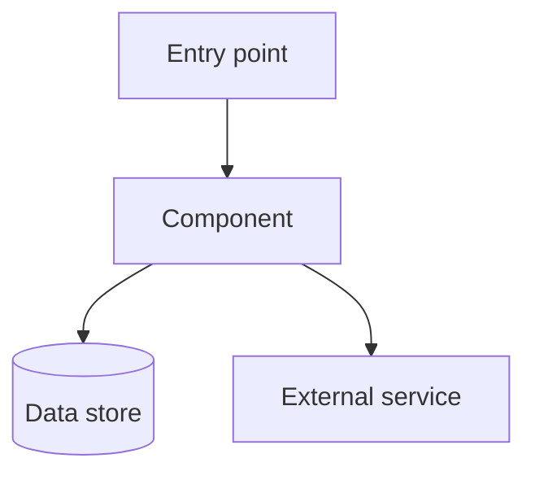
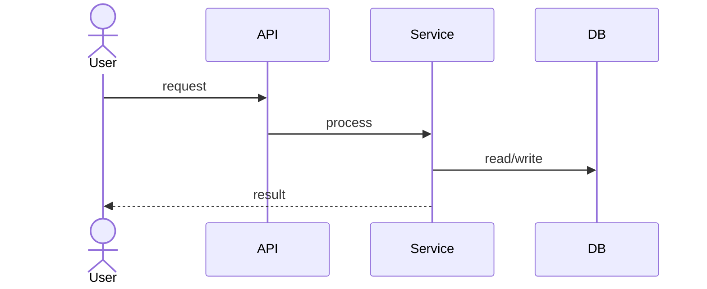
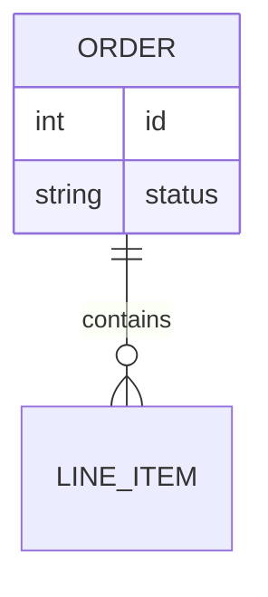

# Architecture — system or component name

## Overview

One paragraph: what this code does and why it exists.

## Context & purpose

Who uses it, what problem it solves, and where it sits in the wider system.

## Component map

Explain each component in one or two lines.

## Key flows

Describe the main flow(s), including important edge cases.

## Data model (if relevant)

## Editable Draw.io diagram

Link to the editable architecture diagram: [architecture-target-slug.drawio](../../docs/architecture-target-slug.drawio)

Use the Draw.io artifact for collaborative review, modernization planning, and presentation-ready architecture views.

## Dependencies & integrations

- Internal:
- External / third-party:
- Configuration & secrets:

## How the code works

A plain-English walkthrough of the important logic, file by file.

## Assumptions, risks & next steps

- Assumptions:
- Risks / unknowns:
- Suggested next steps:
